# Analysis

## What this project set out to test

The original hypothesis was narrow: when a stock's implied volatility trades
well above its realized historical volatility, options are overpriced, and
systematically selling that overpriced premium should be profitable. That
hypothesis is tested here as the Short Straddle strategy. It lost money
(-$307, Sharpe -0.52), and digging into why led to building out 11 more
strategies to see whether the failure was specific to that one bet or part of
a broader pattern. It turned out to be the latter, and that pattern is the
real finding of this project.

## The central limitation, and why it matters more than any single result

There is no free source of historical single-name options chain data. Real
market-implied volatility can't be reconstructed for 25 tickers over 5 years
without a paid data feed. Every strategy in this project prices its options
using a RiskMetrics-style EWMA volatility (λ=0.94, an ~11-day half-life)
computed from realized price history, instead of true market-quoted IV.

This is not a cosmetic substitution. Real market IV almost always trades
above the volatility that subsequently realizes, a well-documented phenomenon
called the volatility risk premium (VRP). Option sellers are compensated for
that premium in real markets. A backward-looking EWMA proxy contains none of
it, since it can only reflect volatility that has already happened, not the
market's forward-looking price of uncertainty.

A direct test of this, run on synthetic data with realistic vol clustering,
confirmed the mechanism: EWMA volatility computed at entry underestimated the
volatility that materialized over the following 30 days on average (0.468
predicted vs. 0.482 realized in the test). Small gap in a clean synthetic
setting; larger in real markets, which also price in event risk (earnings,
macro shocks) that a trailing average can never anticipate.

The consequence shows up cleanly in the full results table:

| Net position | Strategies | All positive or negative? |
|---|---|---|
| Long optionality | Long Put, Long Call, Long Straddle, Long Strangle | All positive |
| Short optionality | Cash-Secured Short Put, Short Straddle, Iron Condor | All negative |

Every pure long-options strategy made money. Every pure short-options
strategy lost money. That is not six independent coin flips landing the same
way, it is a structural artifact of pricing every trade off a proxy that
lacks the risk premium a real market maker would charge. **This backtest is
less a test of "does selling vol work" and more a demonstration of how
pricing methodology, not just strategy logic, can flip a backtest's
conclusion.** That is the headline finding.

Covered Call and Collar sit outside this pattern because they also hold the
underlying stock, and the 2021-2026 window was a broadly rising market for
this basket; their strong results are driven substantially by long stock
exposure, not the options legs.

## Top 5 by Sharpe

1. **Long Straddle** (1.72) — periodic entry, no directional or vol view,
   buying convexity priced without a risk premium. The cleanest illustration
   of the EWMA-pricing effect above.

   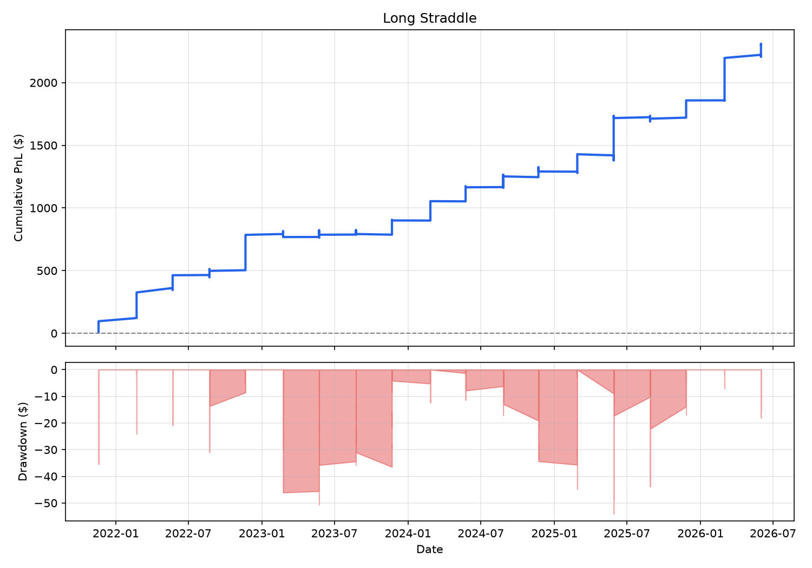

2. **Collar** (1.28) — driven mostly by holding the stock in an up market;
   see caveat above.

   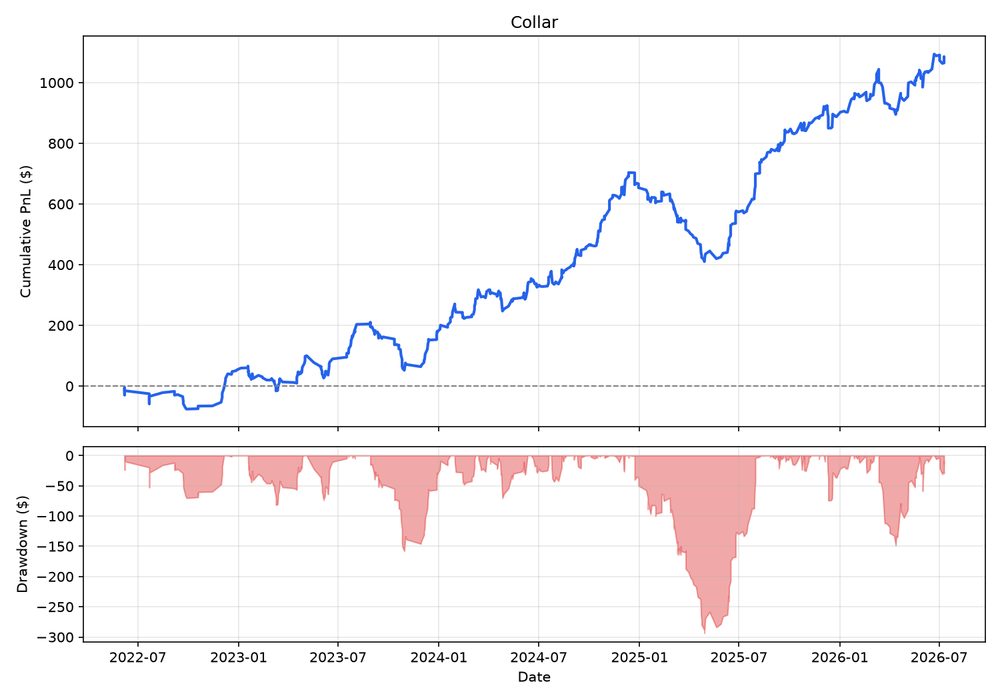

3. **Long Call** (1.07) — 22% win rate, large infrequent wins. Directionally
   correct call: golden-cross entries caught the 2025 recovery.

   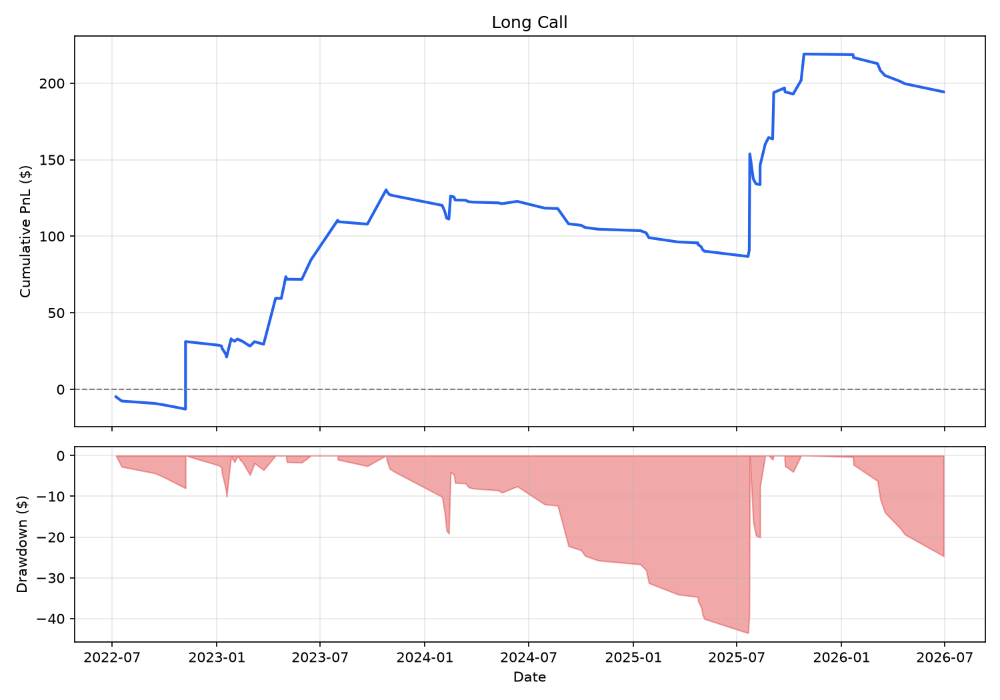

4. **Covered Call** (0.43) — same stock-exposure caveat as Collar.

   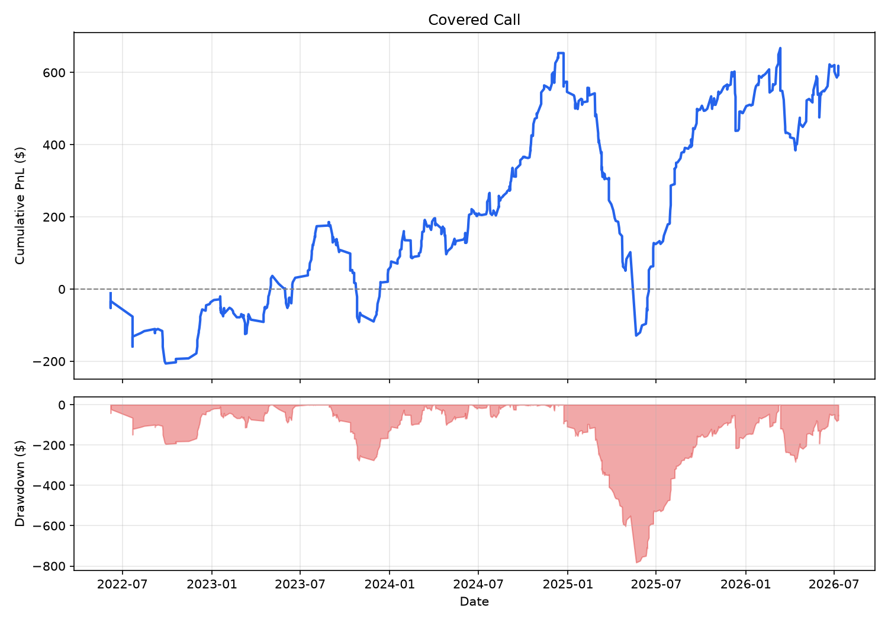

5. **Bull Call Spread** (0.33) — capping the upside at the short strike gave
   up exactly the large 2025 move that made uncapped Long Call the top
   directional performer.

   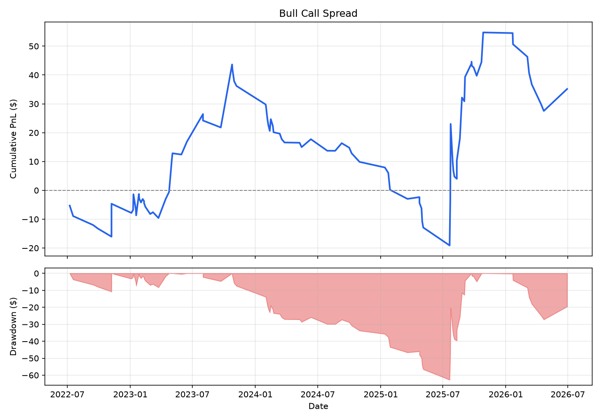

## Bottom 5 by Sharpe

1. **Iron Condor** (-1.03) — defined-risk version of the original short-vol
   hypothesis; same structural headwind as Short Straddle.

   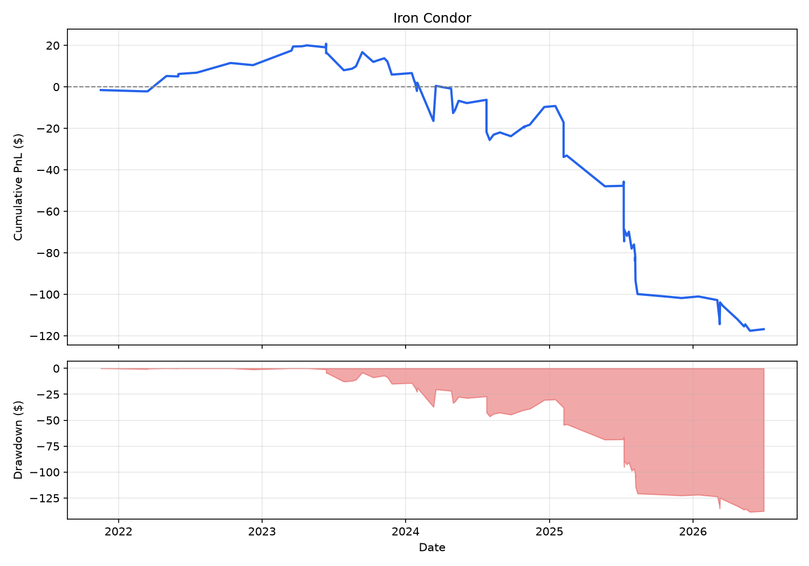

2. **Bear Put Spread** (-1.00) — see the whipsaw case study below.

   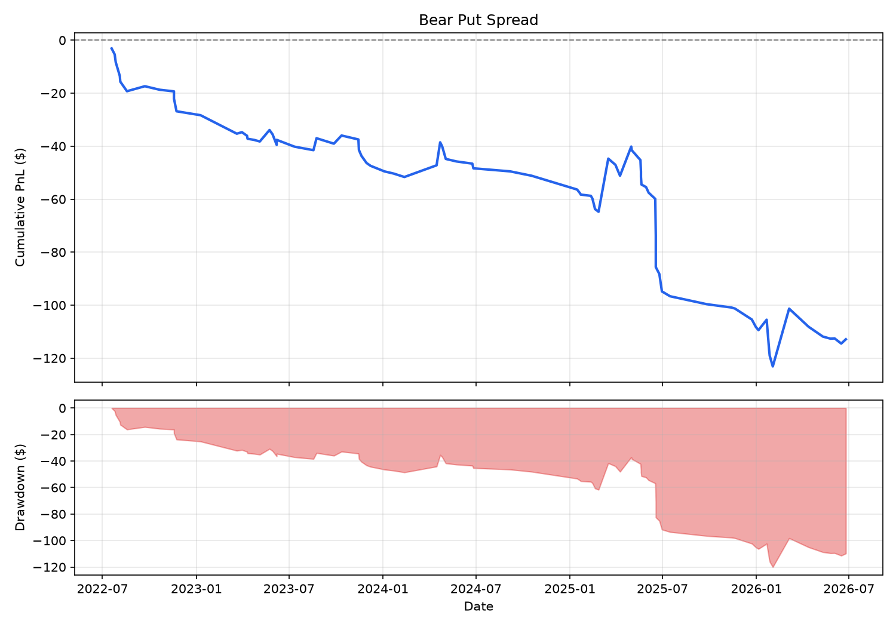

3. **Long Put** (-0.93) — same whipsaw issue as Bear Put Spread.

   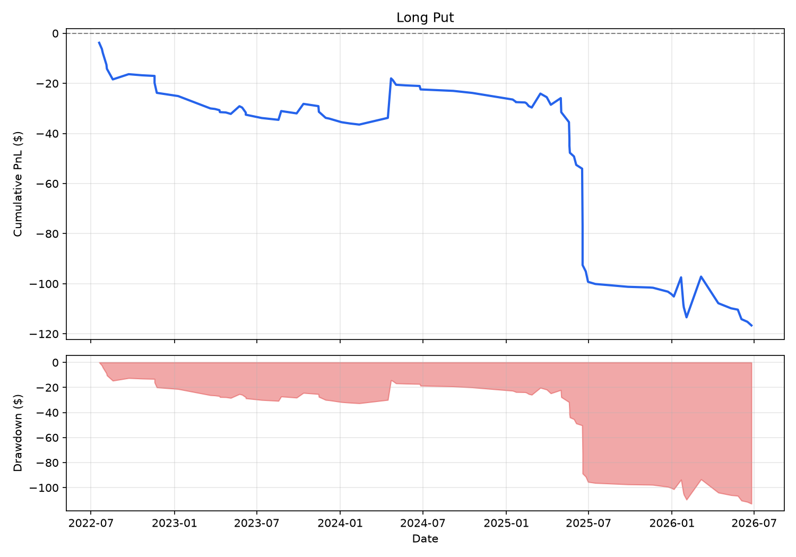

4. **Calendar Spread** (-0.82) — see pin-risk case study below.

   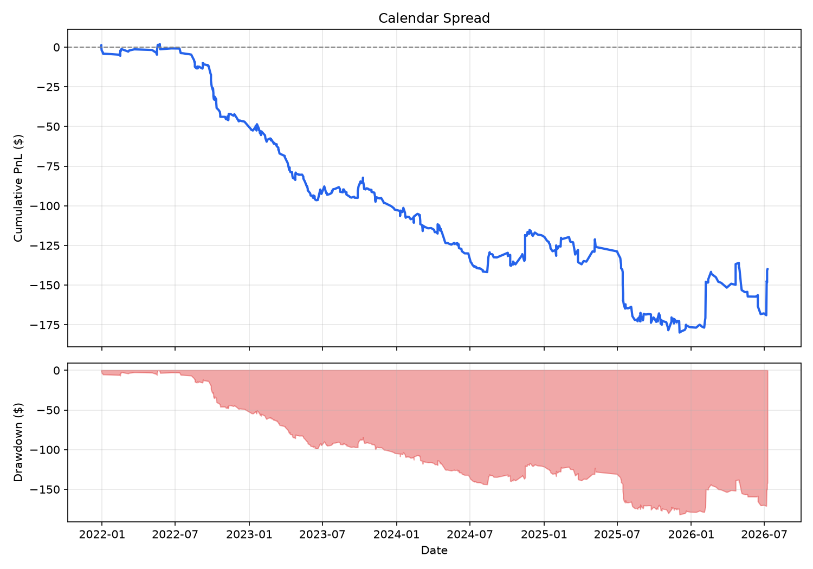

5. **Cash-Secured Short Put** (-0.76) — pure premium-collection with no
   equity upside, hurt by the same EWMA underpricing effect as the other
   short-options strategies, without Covered Call's offsetting stock gains.

   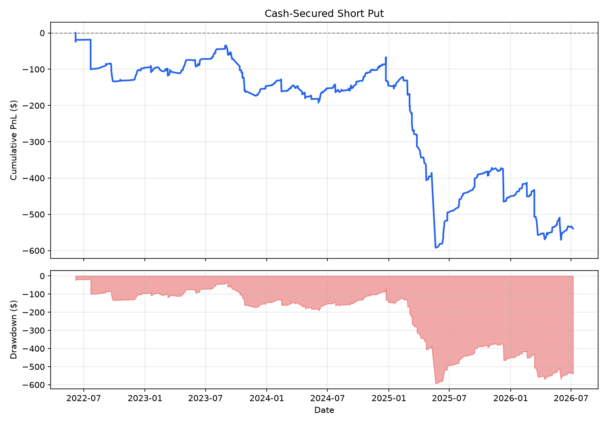

## Case study: the UNH tail event

The single worst trade in the entire project was a Short Straddle sold on
UNH, entered April 9, 2025 at $559, exiting May 22 at $287, a 49% single-name
crash tied to the DOJ investigation and guidance withdrawals. That one trade
lost -$225.78, over half the Short Straddle's total -$307 loss. Even removing
it entirely, out-of-sample Sharpe stayed negative (-1.05) and win rate stayed
below 40%, so it explains a large chunk of the damage but not the whole
story. This is the textbook risk of short volatility: small, steady premium
collection until an idiosyncratic, unhedgeable event erases months of gains
in one trade.

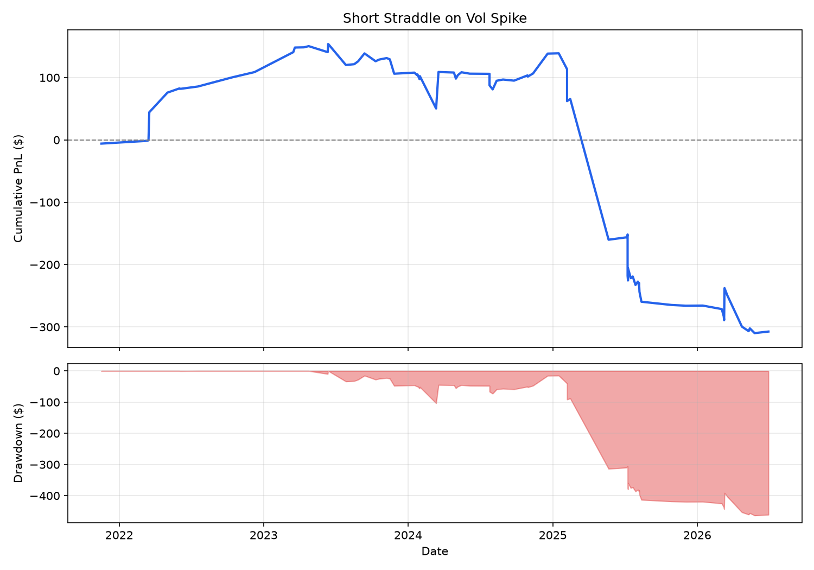

## Case study: moving-average whipsaw

Long Put and Bear Put Spread both use a 50/200-day death cross as their entry
signal, a standard trend-following approach. The worst Long Put trades show
the failure mode clearly: META entered April 2025 at $585 and exited June
2025 at $693, a put bought right as the stock rallied 19% against the
position. The death cross fired at the bottom of the April 2025 selloff,
right as the market reversed, a known weakness of lagging indicators: by the
time a crash is confirmed, it may already be over.

## Case study: calendar spread pin risk

Calendar Spread lost steadily across nearly the entire 5-year window rather
than in one event, a different failure shape from everything else tested
(compare the steady bleed above to the sharp single-event drops elsewhere). A
controlled test confirmed the mechanism: with price and volatility held
perfectly flat, the strategy nets +$1.24 on a $100 stock, matching the
textbook edge from differential time decay between the near- and far-dated
legs. But that edge decays fast as price drifts from the fixed entry strike:
a 5% move flips the trade negative, and it gets worse from there. Real
calendar spreads are actively managed (rolled, re-struck) specifically to
avoid this; a static, unmanaged version surrenders its edge to ordinary price
drift.

## What would improve this

- **Real historical IV data** (paid feed) would remove the central limitation
  and let the original VRP hypothesis be tested properly, on its own terms
  rather than through an EWMA proxy.
- **Position sizing / risk limits** — a per-trade stop-loss would have capped
  the UNH-style tail event without necessarily requiring a smarter signal.
- **Faster-reacting trend signals** (or a regime filter) could reduce the
  whipsaw losses in Long Put and Bear Put Spread.
- **Active strike management** for Calendar Spread (rolling as price drifts)
  would likely recover most of its theoretical edge.
- **Larger sample** — several strategies (Long Call, Bear Put Spread, Iron
  Condor) traded fewer than 100 times over 5 years; Sharpe ratios built on
  that few trades carry real estimation noise.

## Full gallery, all 12 strategies

### Put

### Call

### Combined

### Implied Volatility

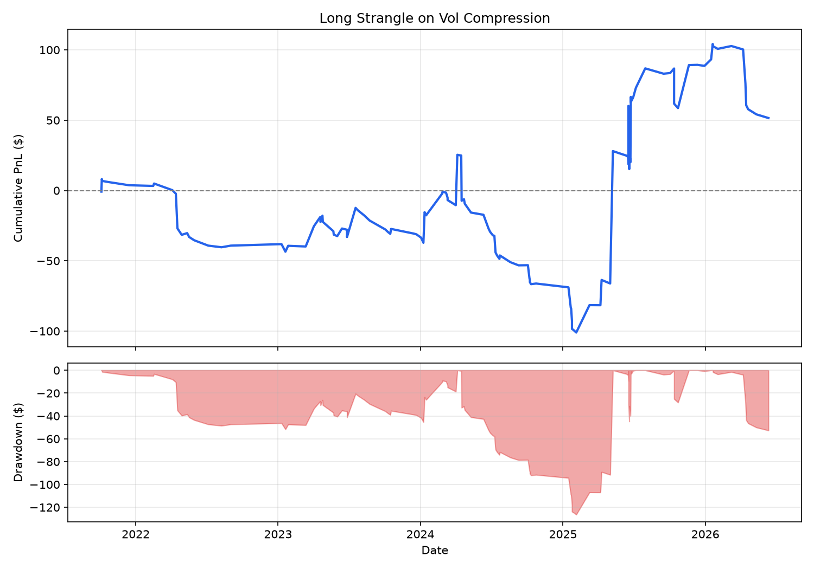
